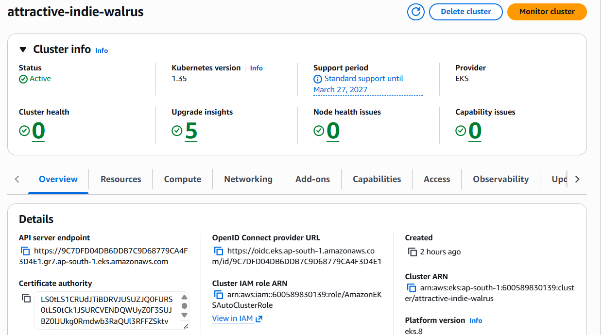
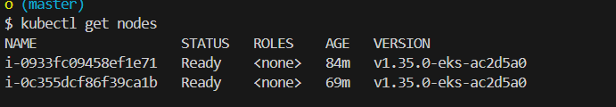
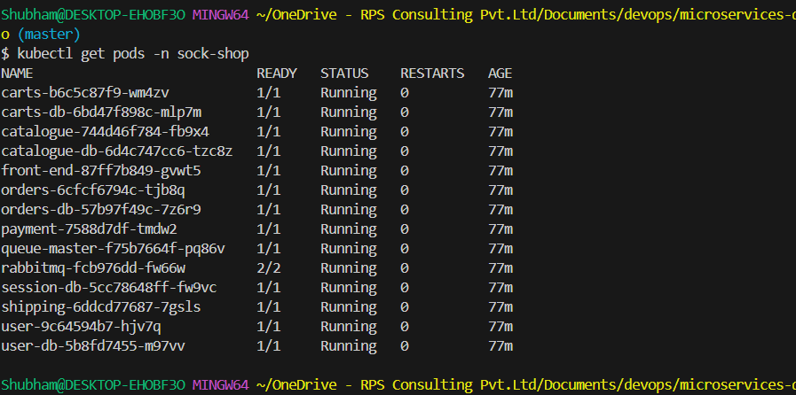
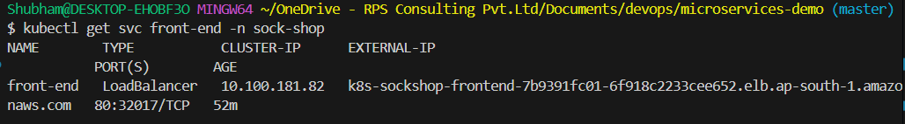
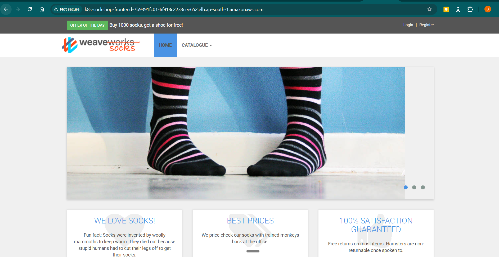

# Submission — Microservices Deployment on AWS EKS

**Submitted by:** Shubham  
**Date:** 20 March 2026  
**Task:** Deploy the Weaveworks Sock Shop Microservices Demo on AWS EKS with a publicly accessible Load Balancer for the front-end service.

---

## Overview

Successfully deployed a multi-service microservices application (`sock-shop`) on an AWS EKS cluster provisioned in auto mode, with all services running and the front-end exposed via an AWS Network Load Balancer (NLB).

---

## Steps Completed

### Step 1 — Forked and Cloned the Repository

Pulled the official [microservices-demo](https://github.com/microservices-demo/microservices-demo) repository into a personal Git account and cloned it locally to begin working on the deployment configuration.

```bash
git https://github.com/microservices-demo/microservices-demo.git
cd microservices-demo
```
---

### Step 2 — Modified the Kubernetes Manifest (`complete-demo.yaml`)

Edited `deploy/kubernetes/complete-demo.yaml` to configure the `front-end` service for AWS Load Balancer Controller compatibility.

**Changes made:**
- Changed the `front-end` Service `type` to `LoadBalancer`
- Added AWS Load Balancer Controller annotations to create an **internet-facing Load Balancer **:

```yaml
apiVersion: v1
kind: Service
metadata:
  name: front-end
  annotations:
    prometheus.io/scrape: "true"
    service.beta.kubernetes.io/aws-load-balancer-type: "external"
    service.beta.kubernetes.io/aws-load-balancer-nlb-target-type: "ip"
    service.beta.kubernetes.io/aws-load-balancer-scheme: "internet-facing"
  labels:
    name: front-end
  namespace: sock-shop
spec:
  type: LoadBalancer
  ports:
    - port: 80
      targetPort: 8079
      protocol: TCP
  selector:
    name: front-end
```

---

### Step 3 — Created the EKS Cluster in Auto Mode

Provisioned an AWS EKS cluster using **EKS Auto Mode**, which automatically manages node groups, scaling, and cluster infrastructure with portal.
Name of the cluster: attractive-indie-walrus 
Region: ap-south-1
mode: Auto mode




---

### Step 4 — Configured IAM Authentication and Permissions

Before connecting `kubectl` to the cluster, set up IAM-based authentication so that the local AWS IAM user had the necessary permissions to interact with the EKS cluster and AWS resources.

This involved:

- Logging in to the AWS Management Console and ensuring the IAM user had the  policies attached to manage EKS cluster and AWS resources
- Configuring the AWS CLI with the IAM user's access key and secret:

```bash
aws login

```


---

### Step 5 — Configured Local `kubectl` to Work with the Cluster

With IAM credentials in place, updated the local kubeconfig to connect `kubectl` to the EKS cluster:

```bash
aws eks update-kubeconfig \
  --name attractive-indie-walrus \
  --region ap-south-1
```

Verified connectivity:

```bash
kubectl get nodes
```

**Output:**
```
NAME                  STATUS   ROLES    AGE   VERSION
i-0933fc09458ef1e71   Ready    <none>   84m   v1.35.0-eks-ac2d5a0
i-0c355dcf86f39ca1b   Ready    <none>   69m   v1.35.0-eks-ac2d5a0
```

Both nodes were in `Ready` state.


### Step 6 — Tagged VPC Subnets for Network Load Balancer Discovery

The AWS Load Balancer Controller requires subnets to be tagged so it can discover which subnets to place the NLB in. Without these tags, the service remains in `Pending` state with the error:

```
Failed build model due to unable to resolve at least one subnet
(0 match VPC and tags: [kubernetes.io/role/elb])
```

**Identified the cluster VPC and public subnets**, then applied the required tags:

```bash
aws ec2 create-tags \
  --region ap-south-1 \
  --resources subnet-08e018ede43c73fd5 subnet-0dffbb9fc3cba7095 subnet-04f0bf682b130a88e \
  --tags \
    Key=kubernetes.io/cluster/attractive-indie-walrus,Value=shared \
    Key=kubernetes.io/role/elb,Value=1
```

| Tag | Value | Purpose |
|-----|-------|---------|
| `kubernetes.io/cluster/attractive-indie-walrus` | `shared` | Links subnet to the EKS cluster |
| `kubernetes.io/role/elb` | `1` | Marks subnets for internet-facing NLB |

---

### Step 7 — Applied the Kubernetes Manifest

Deployed all services and workloads defined in `complete-demo.yaml` to the `sock-shop` namespace:

```bash
kubectl apply -f deploy/kubernetes/complete-demo.yaml
```

---

### Step 8 — Verified the Deployment

Confirmed all pods were running successfully:

```bash
kubectl get pods -n sock-shop
```

**Output — All 14 pods in `Running` state:**

| Pod | Status |
|-----|--------|
| carts | Running |
| carts-db | Running |
| catalogue | Running |
| catalogue-db | Running |
| front-end | Running |
| orders | Running |
| orders-db | Running |
| payment | Running |
| queue-master | Running |
| rabbitmq | Running |
| session-db | Running |
| shipping | Running |
| user | Running |
| user-db | Running |



Confirmed the `front-end` service received an external NLB DNS endpoint:

```bash
kubectl get svc front-end -n sock-shop
```

**Output:**
```
NAME        TYPE           CLUSTER-IP      EXTERNAL-IP                                                                      PORT(S)        AGE
front-end   LoadBalancer   10.100.181.82   k8s-sockshop-frontend-7b9391fc01-6f918c2233cee652.elb.ap-south-1.amazonaws.com   80:32017/TCP   4s
```


The application was accessible publicly via the NLB DNS name on port 80. ✅

---

## Outcome

k8s-sockshop-frontend-7b9391fc01-6f918c2233cee652.elb.ap-south-1.amazonaws.com


---


